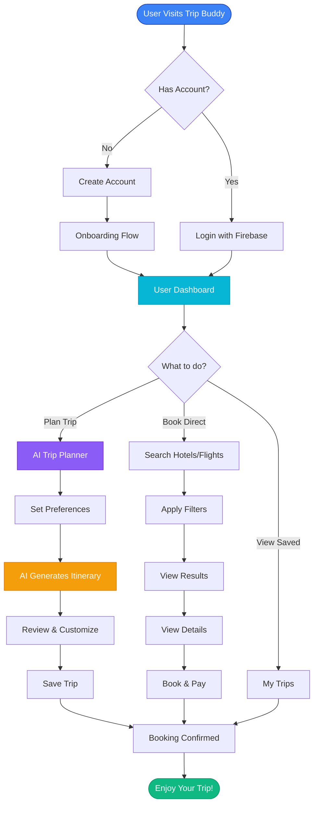
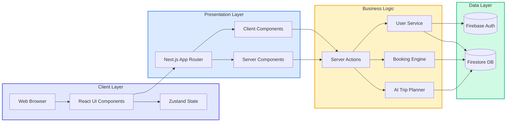

<div align="center">

  <h1>🌍 Trip Buddy ✈️</h1>

  <h3>Your Ultimate AI-Powered Travel Companion</h3>

  <p>
    Plan your dream trip in seconds. Discover hidden gems. Seamless hotel & flight booking.
  </p>

  <!-- Badges -->
  <p>
    <a href="https://nextjs.org">
      
    </a>
    <a href="https://react.dev">
      
    </a>
    <a href="https://tailwindcss.com">
      
    </a>
    <a href="https://firebase.google.com">
      
    </a>
  </p>

  <p>
    <a href="#-features">Features</a> •
    <a href="#-tech-stack">Tech Stack</a> •
    <a href="#-getting-started">Getting Started</a> •
    <a href="#-roadmap">Roadmap</a>
  </p>

  
  
  

</div>

<br />

## 🚀 Overview

**Trip Buddy** is your personal AI travel agent. Built with the latest web technologies, it seamlessly blends flight and hotel booking with intelligent trip planning. Whether you're a solo backpacker or planning a family vacation, Trip Buddy curates the perfect itinerary for you.

> 💭 *"The world is a book and those who do not travel read only one page."* - St. Augustine

---

## ✨ Key Features

<table>
  <tr>
    <td width="50%">
      <h3>🤖 AI Trip Planner</h3>
      <p>Stop spending hours researching. Let our AI generate a personalized day-by-day itinerary based on your interests and budget.</p>
    </td>
    <td width="50%">
      <h3>🏨 Seamless Booking</h3>
      <p>Integrated search for the best deals on hotels and flights with real-time availability.</p>
    </td>
  </tr>
  <tr>
    <td width="50%">
      <h3>🔐 Secure & Personalized</h3>
      <p>Powered by Firebase for secure login/signup and profile management to keep track of your bookings.</p>
    </td>
    <td width="50%">
      <h3>📱 Responsive Design</h3>
      <p>Mobile-first design optimized for on-the-go usage, crafted with Tailwind CSS and Framer Motion.</p>
    </td>
  </tr>
</table>

---

## 🛠️ Tech Stack

<div align="center">

| Frontend | Backend & Services | Tools |
| :--- | :--- | :--- |
|  |  |  |
|  |  |  |
|  |  |  |
|  |  |  |
|  | | |

</div>

---

## 🗺️ User Journey



---

## 🏗️ System Architecture



---

## 📂 Repository Structure

```tree
Trip-Buddy/
├── 📁 app/                     # Next.js App Router pages
│   ├── 🤖 ai-trip/             # AI Trip Generation pages
│   ├── 🔌 api/                 # API Routes
│   ├── 💳 checkout/            # Checkout process
│   ├── 📄 details/             # Hotel/Flight details
│   ├── 🔑 login/               # Login page
│   ├── 🚀 onboarding/          # User onboarding flow
│   ├── 👤 profile/             # User profile & bookings
│   ├── 🔍 search/              # Search results page
│   ├── ✍️  signup/              # Signup page
│   ├── 🗺️  trip/                # Trip details page
│   ├── 📐 layout.tsx           # Root layout with providers
│   ├── 🏠 page.tsx             # Landing page
│   └── 🎨 globals.css          # Global styles
├── 📁 components/              # Reusable UI components
├── 📁 lib/                     # Utilities & Config
├── 📁 types/                   # TypeScript Definitions
├── 📁 public/                  # Static assets
├── 🔐 .env                     # Environment variables
└── 📦 package.json             # Dependencies
```

---

## 🏁 Getting Started

### Prerequisites

*   **Node.js**: v18 or higher
*   **npm**: Latest version

### Installation

1.  **Clone the repository**
    ```bash
    git clone https://github.com/Akshit2004/Trip-Buddy.git
    cd Trip-Buddy
    ```

2.  **Install dependencies**
    ```bash
    npm install
    ```

3.  **Set up environment variables**
    Create a `.env` file in the root directory:
    ```env
    NEXT_PUBLIC_FIREBASE_API_KEY=your_api_key
    NEXT_PUBLIC_FIREBASE_AUTH_DOMAIN=your_auth_domain
    NEXT_PUBLIC_FIREBASE_PROJECT_ID=your_project_id
    NEXT_PUBLIC_FIREBASE_STORAGE_BUCKET=your_storage_bucket
    NEXT_PUBLIC_FIREBASE_MESSAGING_SENDER_ID=your_sender_id
    NEXT_PUBLIC_FIREBASE_APP_ID=your_app_id
    ```

4.  **Run the development server**
    ```bash
    npm run dev
    ```

    Open [http://localhost:3000](http://localhost:3000) to see the app.

---

## 🛣️ Roadmap

- [x] **Phase 1: Foundation** (Setup, Auth, Basic UI)
- [x] **Phase 2: Core Features** (AI Trip Logic, Search UI, Dashboard)
- [ ] **Phase 3: Advanced Features**
    - [ ] Real-time Collaboration
    - [ ] Offline Mode (PWA)
    - [ ] Multi-language Support
    - [ ] Payment Gateway Integration

---

## 🤝 Contributing

We welcome contributions! Please feel free to submit a Pull Request.

1.  Fork the Project
2.  Create your Feature Branch (`git checkout -b feature/AmazingFeature`)
3.  Commit your Changes (`git commit -m 'Add some AmazingFeature'`)
4.  Push to the Branch (`git push origin feature/AmazingFeature`)
5.  Open a Pull Request

---

<div align="center">

Made with ❤️ by [Akshit](https://github.com/Akshit2004)

[](https://github.com/Akshit2004)
[](https://github.com/Akshit2004/Trip-Buddy)

</div>
